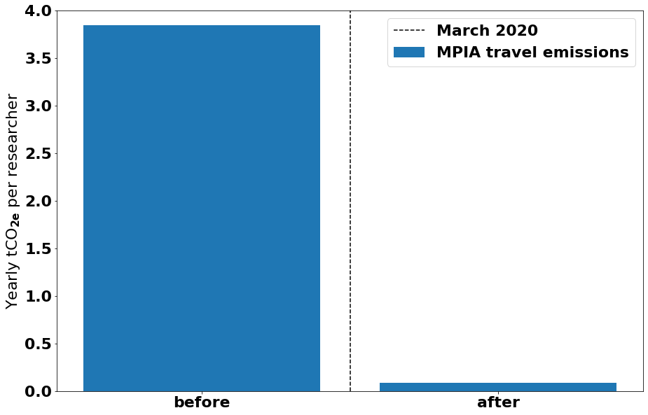

# MPIA_travel_emissions
The sustainability group at MPIA wants to explore the CO2 emitted by their travels.
We got an excel sheet from our travel department (can be extracted from the MPG-wide SAP system). But we exclude it from this repository for data safety reasons and just add an example file.

We calculated the distances traveled taking the direct line between Heidelberg and the destination, multiplying by 2 (return flight) and adding 20% (no direct connection). Then we used the CO2perkm conversion from [Didier Barret](https://travel-footprint-calculator.irap.omp.eu/) (the average of the calculators that use a multiplication factor of 2). We also assume that between 500 and 2000km we linearly transition from 100% train rides (100gCO2/km) to 100% flights. The resulting chart looks like this:

From 2018 till 2020 we had the following destinations:

While most of our destinations where within Europe:

Most of our emissions came from our few oversea flights:

Since March 2020 we know that we can do with less flight:

The talk, which the our sustainability group held in March 2021 at MPIA can be found [here](https://github.com/jan-rybizki/MPIA_travel_emissions/blob/main/data/Flying%20at%20MPIA%20summary%20short.pdf).

This tool can be used to approximately assess/monitor the emissions from business trips. Connectivity to the SAP system of MPG is given. But the data can also be processed using other tools, e.g. the CO2 calculator of [Didier Barret](https://travel-footprint-calculator.irap.omp.eu/).

TODOs:
- Could still add round trip functionality, but happens really rarely.

links: 
- travel to co2: https://www.bbc.com/news/science-environment-49349566
- tool from Didier Barret: https://travel-footprint-calculator.irap.omp.eu/
- Analysis by Milan Klöwer: https://github.com/milankl/CarbonFootprintAGU
